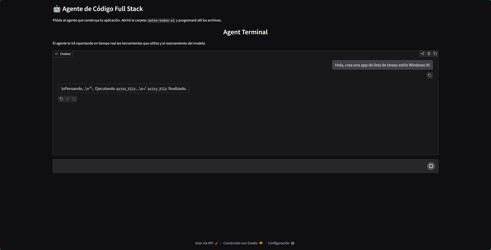
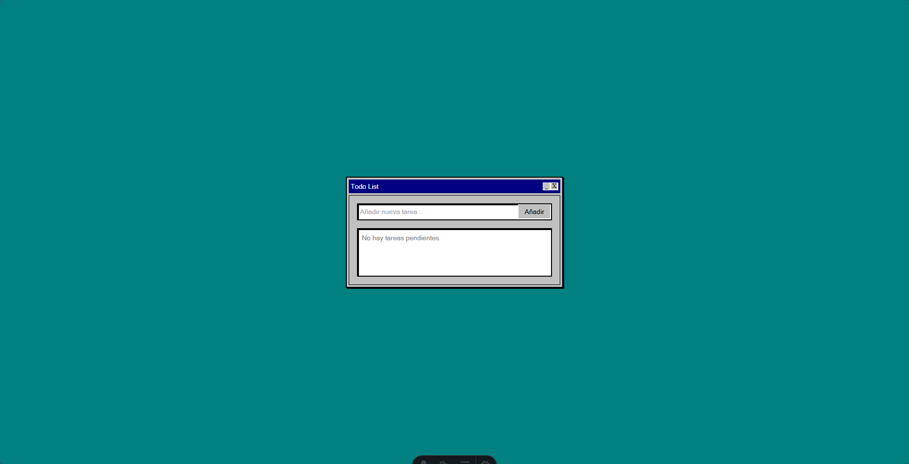
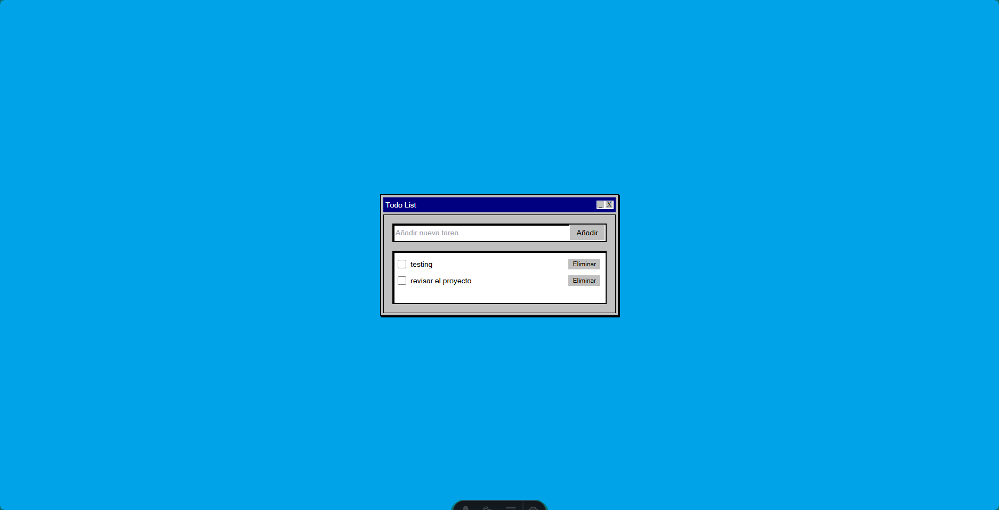

# 🤖 Full Stack Code Agent

 

This repository contains the complete architecture for an **Asynchronous Code Agent** programmed in Python. It is capable of interacting through a Chat interface (Gradio), receiving commands in natural language, and programming complete Full Stack projects *autonomously* using Astro, React, and TailwindCSS as its local system tools (I/O).

## 🚀 Key Features (The Context Problem)

Agents often lose track (run out of memory) after long conversations because they exhaust the foundation models' context limits. To prevent this, this project implements an innovative **Runtime Summary (Context Compression)** mechanism.

1. We have defined a hard limit of `40,000` tokens.
2. Upon dynamically exceeding the limit during execution, the agent takes the oldest 70% of the technical history messages.
3. It transfers them to the LLM (Gemini 2.5 Flash) to generate a **highly concentrated summary**, ensuring no directives are lost.
4. This summary is injected, and the old separate messages are discarded, freeing up memory so the agent can iterate infinitely.

---

## 📸 Deliverable: App Screenshots (Before and After)

Demonstrations of completing Tasks 1 and 2 can be found in the `docs/` folder of this repository.
The agent autonomously programmed a Windows 95 style "To-Do List" React component and, through Task 2, improve design with new background color.

### Task 1 (Before Fix)
 

### Task 2 (After Fix)
 

---

## 🧠 Deliverable: Reflection Cells

### 1. Why does compressing the oldest 70% of messages work better than just cutting them entirely or summarizing 100%?
Compressing the oldest 70% preserves the most recent 30% of the conversation in its original, exact format. This "recent 30%" contains the model's purely immediate, tactical train of thought (e.g., "I just read the file, now I'm going to edit this line"). If 100% were incorrectly summarized, the LLM would forget what it was currently about to do in real-time, suffering from "Context Amnesia," resulting in a blind loop.

### 2. What is the risk of summarizing history, and how was it mitigated in this Agent?
The risk of any summary is **omission hallucination** (the LLM forgetting key parameters set at the beginning of the conversation). In our `compress_context` function within `agent.py`, we prevent this by using a strict fallback prompt *"Please summarize... Retain all technical decisions, file changes..."* and ensuring our global instructional role system (`SYSTEM_PROMPT_WEB_DEV`) never becomes part of the compressible block.

### 3. How does the Agent react to the use of tools (Functions / Tools)?
Tools empower the agent to move from simple text chat to action. In our console and Gradio interface, we observe the "Step-by-Step" reaction: The agent evaluates its goal, decides which tool to call (e.g., `read_file`), *pauses* its own generation, and asks us for the data via `function_call`. Our Python reads it and silently sends the data in `function_response`. The agent reacts by processing the returned bytes, interpreting whether it was a success or error, without any user intervention.

---

## 🛠️ Stack and Local Usage

- **Magic Models**: `google-genai` (Gemini 2.5 Flash)
- **Chat UI**: `gradio`
- **Settings/Env**: `.env` virtual environments with `python-dotenv`.
- **Output**: Capable of compiling `Astro` projects directly on the disk.

### Running Locally
1. Clone the repository and initialize `uv` env:
```bash
uv venv
uv pip install google-genai python-dotenv gradio
```

2. Inject your API in a `.env` file at the root path:
```text
GEMINI_API_KEY="AIzaSy..."
```

3. Run the main Gradio UI:
```bash
uv run python app.py
```
> *Open `http://127.0.0.1:7860/` in your browser and order it to build a world.*
